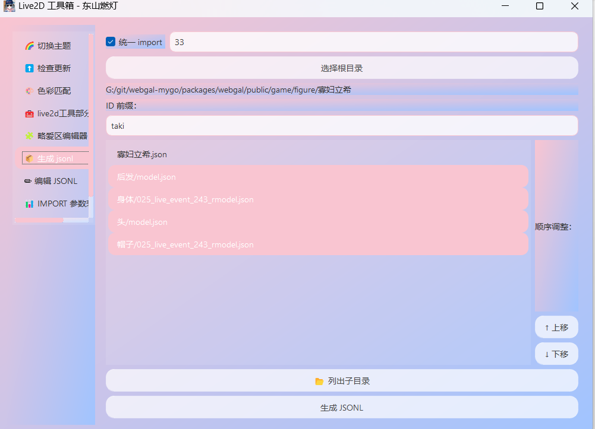
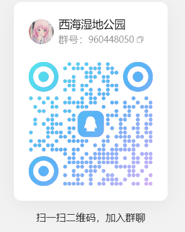
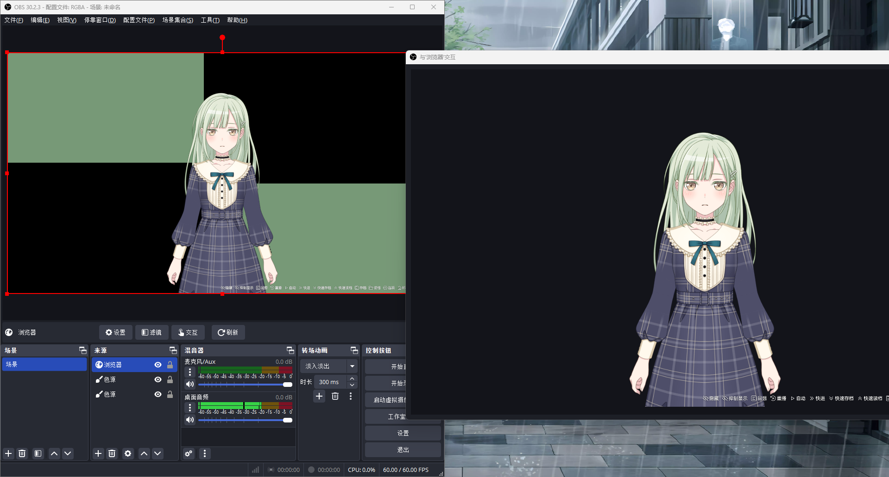
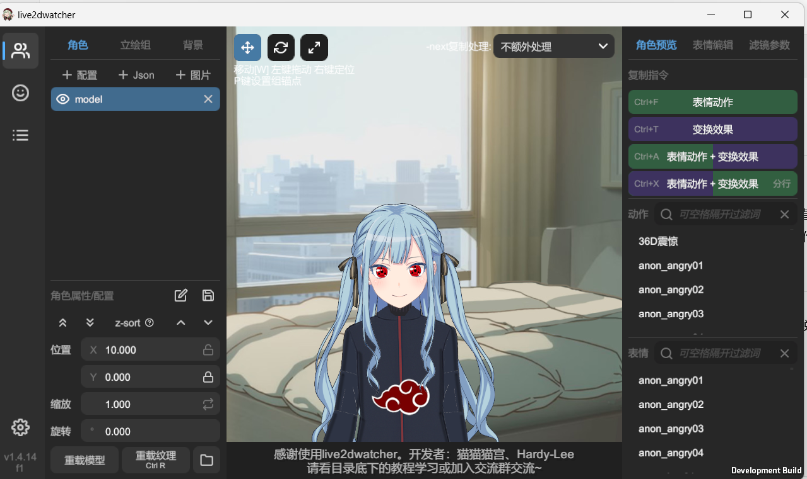
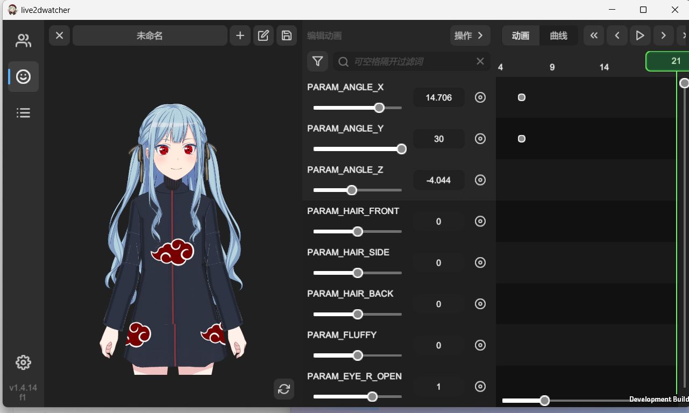
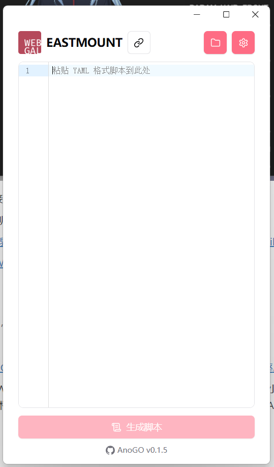
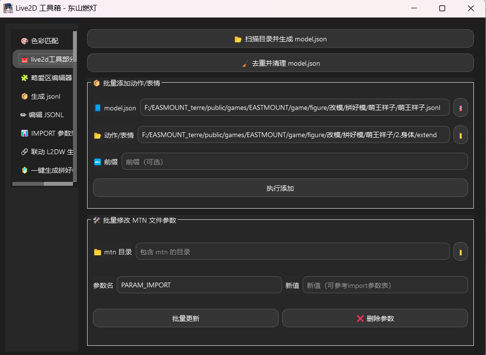
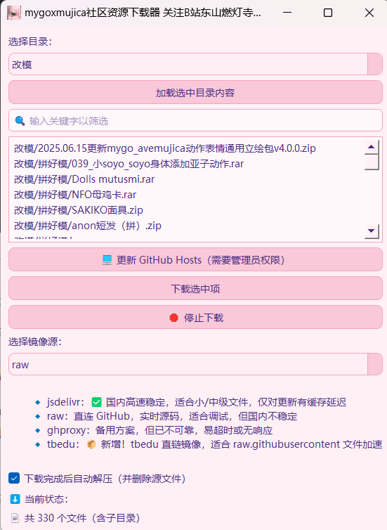
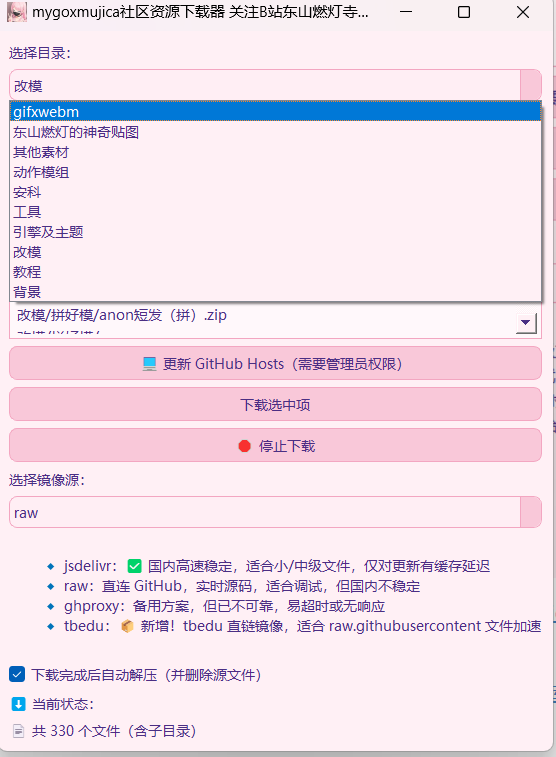

# 🌐 WebGAL 社区工具整理

## 🧱 1. WebGAL 引擎类

### 1. **webgal源码**
   - 由b站up主[邻家码农真昼酱](https://space.bilibili.com/7321105)领衔制作的**全新网页端视觉小说引擎**
   - WebGAL github地址:[OpenWebGAL/WebGAL: A brand new web Visual Novel engine | 全新的网页端视觉小说引擎](https://github.com/OpenWebGAL/WebGAL)
   - WebGAL_Terre github地址:[OpenWebGAL/WebGAL_Terre: Galgame Editing. Redefined | 视觉小说编辑，再进化](https://github.com/OpenWebGAL/WebGAL_Terre/)

### 2. **mygo专版引擎** 

   - 由社区爱好者[幸运咪啪之谣](https://space.bilibili.com/42836331)开始制作的webgal社区引擎
   - github地址:[boomwwww/webgal-mygo: WebGAL_MYGO专版引擎](https://github.com/boomwwww/webgal-mygo)
   - 获取方式:通过加群**MyGO!!!!! Web迷路群**获得，或者从release界面下载
   - 
   - 内置mygoxmujica所需要的相关素材，如立绘、背景和背景音乐等
   - 支持live2d，自mygo3.0起支持聚合模型(拼好模)
   - 自mygo3.0其拥有与主支不同的图形化编辑器

### 3. **Bandori Craft引擎**

   - 由b站up主[明见](https://space.bilibili.com/3638936)制作的仿bandream手游引擎
   - 内置mygoxmujica所需要的相关素材，如立绘、背景和背景音乐等
   - 演示视频:[【WebGAL MyGO】二创定制引擎 BandoriCraft Engine 发布_哔哩哔哩_bilibili](https://www.bilibili.com/video/BV1pGLUzYERL?spm_id_from=333.788.videopod.sections&vd_source=5f963e671ec6d6a17235f4481a85a980)
   - 获取方式:通过加明见老师粉丝群获得

### 4. **EASTMOUNT 引擎**

   - 由b站up主[东山燃灯寺](https://space.bilibili.com/296330875)制作的引擎，实现对聚合模型、spine、gif等的支持

   - github地址:[KonshinHaoshin/dongshan_Engine](https://github.com/KonshinHaoshin/dongshan_Engine)

   - 关于聚合模型部分需要搭配[工具箱](https://github.com/KonshinHaoshin/gen_model)使用生成jsonl文件

   - 

     > 工具箱界面如图示
     
   - `EASTMOUNT`引擎存在分支`EMPE`,该引擎可以实现4k录制透明底素材，`EMPE`功能实现基于[Project-AnyGO/WebGAL-PartialEngine](https://github.com/Project-AnyGO/WebGAL-PartialEngine)实现，`EMPE`由[东山燃灯寺](https://space.bilibili.com/296330875)和[速食的爱音](https://space.bilibili.com/3546647460055236)共同制作。使用示例：[能够录制透明底的webgal引擎_哔哩哔哩_bilibili](https://www.bilibili.com/video/BV1KEMXz8EXQ/?spm_id_from=333.1387.homepage.video_card.click)

   - 最好使用EASTMOUNT引擎需要搭配其特制的terre

   - 获取方式

   - 

### 5. **PartialEngine**

   - 由b站up主[速食的爱音](https://space.bilibili.com/3546647460055236)制作的引擎。通过修改 CSS 文件，实现了画面的完全透明。这使你可以在无背景的情况下，直接使用 OBS Studio 捕获包含 Alpha 通道的 WebGAL 画面，无需再进行绿幕抠图等操作。
   - 
   - github:[Project-AnyGO/WebGAL-PartialEngine: 该二创引擎允许你录制带有 Alpha 通道的 WebGAL 画面，以及 4K 清晰度（实验）。](https://github.com/Project-AnyGO/WebGAL-PartialEngine)
   - 获取方式:通过github的release界面下载

## 🧱 2. live2d工具类

> 目前社区内通行的大部分工具支持，且仅支持cubism2的live2d……
>
> 某种意义上有点倒反天罡

### 1.live2dwatcher

- 基于 Unity 实现的 Live2D 动作与表情编辑器，专注于 Cubism 2.0 模型的可视化调试与编辑。支持直接生成 WebGAL 脚本代码，以及兼容 `.conf` 格式的聚合模型配置导出，适用于拼接式 Live2D 模型工作流程。由[猫猫猫宫](https://space.bilibili.com/471367)和[Hardy--Lee](https://space.bilibili.com/88300709)开发。

- 支持输出透明通道的png，可用于制作安科图包。

- 一般情况下简称为l2dw

- 

  > 界面如图示
  
- 可以通过绘制曲线实现编辑mtn文件

  

- 通过`spout2`间接支持的输出透明底素材功能。

- 获取方式:加猫老师的群

- 演示视频:[炫酷新界面新功能，大幅提升你的假药制作体验与效率！_哔哩哔哩_bilibili](https://www.bilibili.com/video/BV1dcLRzNEiE/?spm_id_from=333.1387.upload.video_card.click&vd_source=5f963e671ec6d6a17235f4481a85a980)

- github地址:[LostWaym/webgal-tool-l2dw](https://github.com/LostWaym/webgal-tool-l2dw)

### 2.anogo

> 从各种意义上来讲，这都是用的最多的工具

- 太伟大了anogo

- 演示视频:[【WebGAL+MyGO】从文本到脚本，结合 AI 提升你的假药创作效率_哔哩哔哩_bilibili](https://www.bilibili.com/video/BV1yskbYqE1w/?spm_id_from=333.337.search-card.all.click&vd_source=5f963e671ec6d6a17235f4481a85a980)

- **AnoGO** 是一款 WebGAL 的 MyGO 二创辅助工具，旨在助力创作者高效地将小说文本转换为 WebGAL 脚本。通过结合先进的大语言模型（LLM）技术，AnoGO 简化了创作流程，显著提升创作速度，让 WebGAL 的制作变得轻松简单。由[明见](https://space.bilibili.com/3638936)老师开发

- 

> 界面如图示
- 加大程度缩减同人文视频化时间，通过`LLM`生成yaml和代码，被大量up主广泛使用
- github地址:[A-kirami/anogo: WebGAL 脚本辅助生成器](https://github.com/A-kirami/anogo)
- 🌟 **特性**

  - **开箱即用**：无需复杂配置，简单几步将小说文本转换为 WebGAL 脚本。
  - **图形化界面**：直观易用的图形化界面设计，无需编程基础也能轻松上手。
  - **高效创作**：借助 AI 智能辅助，快速完成 WebGAL 脚本制作，提升创作效率。
- 获取方式:同`Bandori Craft引擎`

### 3.live2dtoolbox

- 一个持续更新的强大工具箱，优点是功能很大，缺点是bug又多又抽象。
- 目前已经实现功能有:
  - 批量添加动作表情、一键生成`model.json`或者`jsonl`聚合模型。
  - 编辑`jsonl`各项参数，察隅import参数表。
  - 联动`l2dw`实现生成或反推conf文件（正在开发中）。
  - 一键生成拼好模
- 
  > 界面如下
- 使用教程：会有的，确信
- github地址:[KonshinHaoshin/gen_model: 一个用于webgal和live2dv2的图形化工具箱，基于py-live2d和pyqt实现](https://github.com/KonshinHaoshin/gen_model)

### 4.社区资源下载器mygoxmujica_archive_downloader

- 一个为 WebGAL 项目的 mygoxmujica 系列资源设计的图形化 GitHub 下载器。支持从指定仓库快速下载角色改模、动作模组、工具等分类资源，支持多镜像加速、二次元 UI 风格美化、断点中断、子路径保存等实用功能。内置7z.exe实现解压。
- 
- 用户可以自行检索由[东山燃灯寺](https://space.bilibili.com/296330875)收集整理在[KonshinHaoshin/mygoxmujica_archive: 用于存放可用于webgal的mygoxmujica相关资源](https://github.com/KonshinHaoshin/mygoxmujica_archive)仓库内的社区资源。包括图下各类型的素材文件。
- 
- 使用方法:
  - 下载**改模**时，建议选择用户项目中的`figure`目录，会自行解压到对应的目录里面。
  - `webgal`原生不支持`gif`
  - 素材来源于`bestdori`

- github地址:[KonshinHaoshin/mygoxmujica_archive_downloader: 资料库下载器](https://github.com/KonshinHaoshin/mygoxmujica_archive_downloader)

### 5.webgal自动化工具集

- WebGAL Tools 是一套为 WebGAL 视觉小说引擎提供的工具集，专注于**语音合成**、资源管理和开发辅助功能。

- WebGAL Tools 是一个模块化工具集，主要包含以下组件：

  - **语音合成服务 (Voice)** - 基于 GPT-SoVITS 的语音合成系统，支持静态和动态角色配置
  - **MCP 服务器 (MCP-Server)** - 实现 Model Context Protocol 的服务器，提供智能上下文处理
  - **配置管理 (Config)** - 统一的配置管理系统，支持模板和初始化
  - **命令行工具 (CLI)** - 提供命令行界面，方便集成到开发工作流
  - **Web UI (Voice-UI)** - 图形化界面，简化配置和操作流程

  该工具集设计用于简化 WebGAL 游戏开发中的语音合成工作流，支持多语言翻译、情感识别和批量处理。

- 由b站up主[小宝皮龙](https://space.bilibili.com/169466687)制作。使用教程:[webgal-tools beta版使用教程# (第一期) 快速上手_哔哩哔哩_bilibili](https://www.bilibili.com/video/BV1ZYG3zkEaj)

- github地址:[floatDreamWithSong/webgal-tools: webgal自动化工具集](https://github.com/floatDreamWithSong/webgal-tools)

